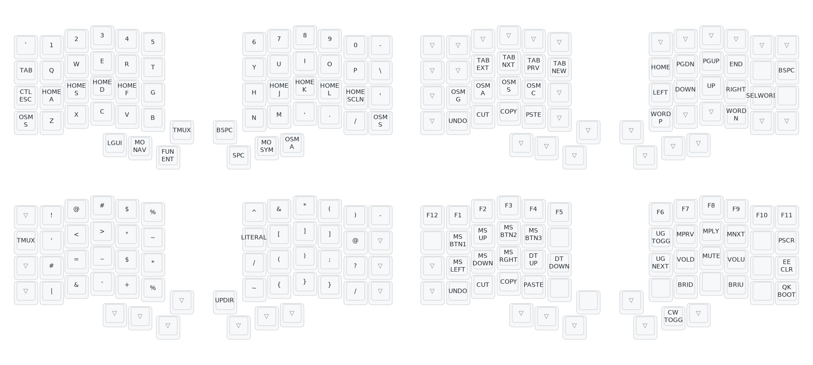

# QMK Keymap for the Iris CE



## How to use

This repository is a valid QMK external userspace as documented [here](https://docs.qmk.fm/newbs_external_userspace). To use it, you need:

1. QMK setup locally. See [QMK Docs](https://docs.qmk.fm/newbs_getting_started) for details
2. Clone this repository and add it as an overlay:

   ```
    qmk config user.overlay_dir="/home/chzerv/qmk_keymap/"
   ```

3. To build the firmware:
   ```shell
   qmk flash -kb keebio/iris_ce/rev1 -km chzerv
   ```

## TODO

- [ ] My symbol layer needs a bit more tweaking
- **If** we keep using HRMs:
  - [ ] Re-enable Achordion's Bilateral Combinations
    - Need to first create exceptions for common shortcuts
  - [ ] Further tweak Achordion so we don't have any misfires

# Credits

- [Pascal Getreuer's QMK keymap](https://github.com/getreuer/qmk-keymap/tree/main)
- [Sunaku's "Glorious Engrammer" keymap](https://github.com/sunaku/glove80-keymaps)
