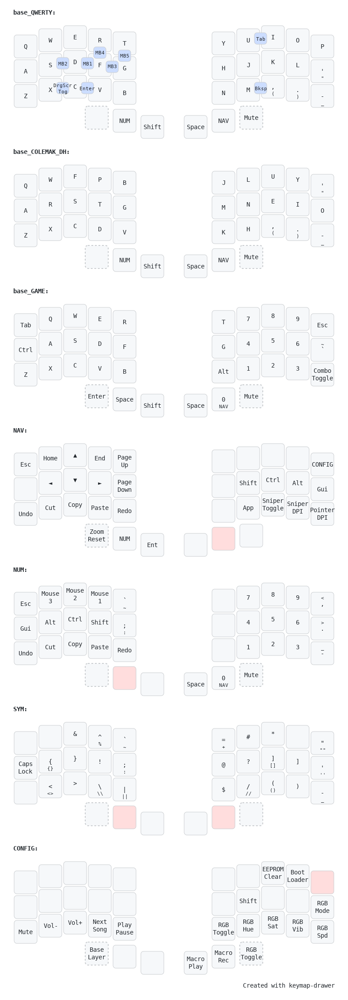

# T4CORUN Userspace

My userspace for building QMK firmware via GitHub Actions. This does not require a local build environment where files are placed within keyboard subfolders.

## Layout

The custom layout optimizes for programming (SQL, Powershell, C) and minimizes holds for comfort. It started from [Manna Harbor Miryoku](https://github.com/manna-harbour/miryoku) and took heavy influence from [Jonas Hietala T-34](https://www.jonashietala.se/series/t-34/). Design Themes:

- The keymap designed for my ideal board: split 3x5 boards with five thumb keys, right side encoder, combined with a Ploopy Nano trackball mouse
- The userspace supports a sixth thumb key and left side encoder as well
- Releasing all keys always brings you back to base layer
- Layers are designed orthogonally with a single purpose per hand and are accessed by holding a thumb key on the opposite hand
- Reworking Symbols for programming focus
  - Common symbols are positioned under stronger fingers
  - Custom behavior from holds
- Advanced encoder map functionality to minimize/simplify layers

## Features

### Build Non-Tree Keyboards

- Extended the [qmk/.github](https://github.com/qmk/.github) userspace build actions to build non-tree qmk keyboards (e.g. Barbellboards Rollow). This works by copying keyboard definitions from the userspace to the qmk_firmware keyboards folder in the container. The list of keyboards to copy are defined in `qmk_nontree.json`

### Layout Wrapper Macros

A single keymap layout can be shared with multiple keyboards by using C preprocessor macros. These macros are referenced in the keyboard JSON files, and the build process will expand them into a transient keymap.c file during compile time.

In this userspace, the base split 3x5_3 with dual encoders layout can be adapted for other split keyboards by expanding it with macros. For example, there is a wrapper that will add extra columns to the base layout for a Corne's 42-key 3x6_3 layout.

### Tri-Layer

Hold both thumb momentary layer keys `NAVIGATION` and `NUMBER` to access the `SYMBOL` layer

### One Shot Mods

One Shot Mods is here to minimize holding, simplify layers, and avoid misfires from having Home Row Mods. Here we have bi-lateral(ish) GACS mods.

### Mouse Keys

This layout is designed to be used with a Ploopy Nano. Mouse buttons and scroll wheel is handled on the keyboard side via combos. There are macros with the host status (Scroll lock, Num Lock) to switch DPI and enable momentary drag scrolling

### Caps Word

Caps Word enables temporary all-caps typing without holding shift. Useful to typing programming variables. Tap `shift` twice to enable Caps Word. It cancels when any key is pressed except

- `numbers 0-9`
- `backspace`
- `delete`
- `underscore`

### Tap-Holds

Certain keys have different behaviors when held vs tapped allowing commonly typed programming syntax or shifting certain keycodes without actually pressing/holding shift

| Keycode   | When tapped | When held               | Comments                          |
| --------- | ----------- | ----------------------- | --------------------------------- |
| `TR_LBRC` | `[`         | `[]` with cursor inside |                                   |
| `TR_LABK` | `<`         | `<>` with cursor inside |                                   |
| `TR_LPRN` | `(`         | `()` with cursor inside |                                   |
| `TR_SQUO` | `"`         | `""` with cursor inside |                                   |
| `TR_SQUO` | `'`         | `''` with cursor inside |                                   |
| `TR_BSLS` | `\`         | `\\`                    |                                   |
| `TR_SLSH` | `/`         | `//`                    |                                   |
| `TR_PIPE` | `\|`        | `\|\|`                  |                                   |
| `TR_COMM` | `,`         | `(`                     | enables parenthesis on base layer |
| `TR_DOT`  | `.`         | `)`                     |                                   |
| `TR_PERC` | `%`         | `^`                     |                                   |
| `TR_EQL`  | `=`         | `+`                     |                                   |
| `TR_MINS` | `-`         | `_`                     |                                   |
| `TR_GRV`  | `backtick`  | `~`                     |                                   |
| `TR_SCLN` | `;`         | `:`                     |                                   |
| `TR_QUOT` | `'`         | `"`                     |                                   |

Opted to implement overrides here instead of using built-in Key Override functionality because this implementation does not require pressing/holding shift to get the alternate key

### Combos

Enables additional keys to be mapped by pressing multiple keys simultaneously. Primarily used to enable mouse functionality on base layer

| Combo         | Result               | Comment                                           |
| ------------- | -------------------- | ------------------------------------------------- |
| `C` + `V`     | `KC_BTN2`            | Left click. Mouse buttons only work on base layer |
| `X` + `V`     | `Drag Scroll Hold`   | Actual command varies per board                   |

### Advanced Encoder Functionality

Implemented custom keycodes for encoders to enable modifiers to change encoder output and enable window/tab switching and mouse wheel zoom. The purpose is to remove seldomly used feature configuration keys to simplify the keymap

#### Tabbing

The NUM layer right side encoder will `tab` and `shift+tab`. Holding `alt` or `ctrl` will allow Window or Browser tab switching

#### Zoom

The MOUSE_FUNCTION layer right side encoder will send `ctrl+mouse wheel up` and `ctrl+mouse wheel down` without having to hold modifiers

#### Configuration changes

The NAV layer right side encoder behavior depends on what modifier is held. Refer to the table below

| Held Modifier | Result                                               |
| ------------- | ---------------------------------------------------- |
| None          | Cycles through base layers: QWERTY, COLEMAK DH, GAME |
| Shift         | Changes RGB Matrix Hue                               |
| Ctrl          | Changes RGB Matrix Sat                               |
| Alt           | Changes RGB Matrix Brightness                        |
| Gui           | Changes RGB Matrix Animation Speed                   |
| Shift+Ctrl    | Changes RGB Matrix Animation                         |
| Ctrl+Alt      | Changes Haptic Feedback Frequency                    |
| Alt+Gui       | Changes Audio Click Frequency                        |

### Advanced Config Toggle

Implemented a custom keycode to enable modifiers to affect which feature is toggled. Similar to the Advanced Encoder, the purpose is to remove seldomly used keycodes and simplify the keymap. Refer to the table below

| Held Modifier | Result                                               |
| ------------- | ---------------------------------------------------- |
| None          | Cycles through base layers: QWERTY, COLEMAK DH, GAME |
| Shift         | Enter Bootloader                                     |
| Ctrl          | Enter Ploopy Nano Bootloader                         |
| Alt           | Toggle RGB Matrix On/Off                             |
| Gui           | Toggle Combos On/Off                                 |
| Shift+Ctrl    | Toggle Haptic Feedback On/Off                        |
| Ctrl+Alt      | Toggle Audio On/Off                                  |
| Alt+Gui       | Toggle Audio Clicks On/Off                           |

## Optional Features

These features can be disabled due to MCU size constraints or because certain keyboards do not support it

### Pointing Device

Enables trackball functionality on certain boards (e.g., Ploopy Nano and Bastardkb Charybdis Nano). The board definitions enables unique functionality:

- Charybdis Nano: "Sniper" precision tracking, toggle/momentary drag scroll, DPI changes
- Ploopy Nano: Ties with Host State for momentary drag scroll, dpi changes, and bootloader

Note: `MOUSEKEY_ENABLE` do not need to be enabled in tandem with this to get the mouse buttons.
Note: Enabling Num Lock, Caps Lock, and Scroll Lock simultaneously will tell the Ploopy Nano to enter bootloader mode

### RGB Matrix

Enable RGB lighting effects for large MCU memory footprints. Review the keyboard files to identify the key position for each LED and update the preprocessor definitions in `config.h`

### OLED

Enables keyboard status visualization. Shows information like selected layer, active modifiers, and host state (e.g, Num / Caps / Scroll Lock), and Luna pet animation

### Haptic Feedback and Audio

Basic keyboard buzzing and key click audio for the Geist KLOR.

## Target Keyboards

All boards use my keymaps unless noted

- Ploopy Nano
- Bastardkb Charybdis Nano 3x5
- Planck Rev6
- Ferris Swoop
- Barbell Rollow (non-tree)
- Geist KLOR (non-tree)
- DZRGB60v2 (coming)
- Crkbd 3x6 (deprecated)

## Links

- [qmk documentation](https://docs.qmk.fm/#/)
- [qmk/awesome-userspaces Github](https://github.com/qmk/awesome-userspaces?tab=readme-ov-file). Links to fantastic userspaces to draw inspiration from, such as Drashna's
